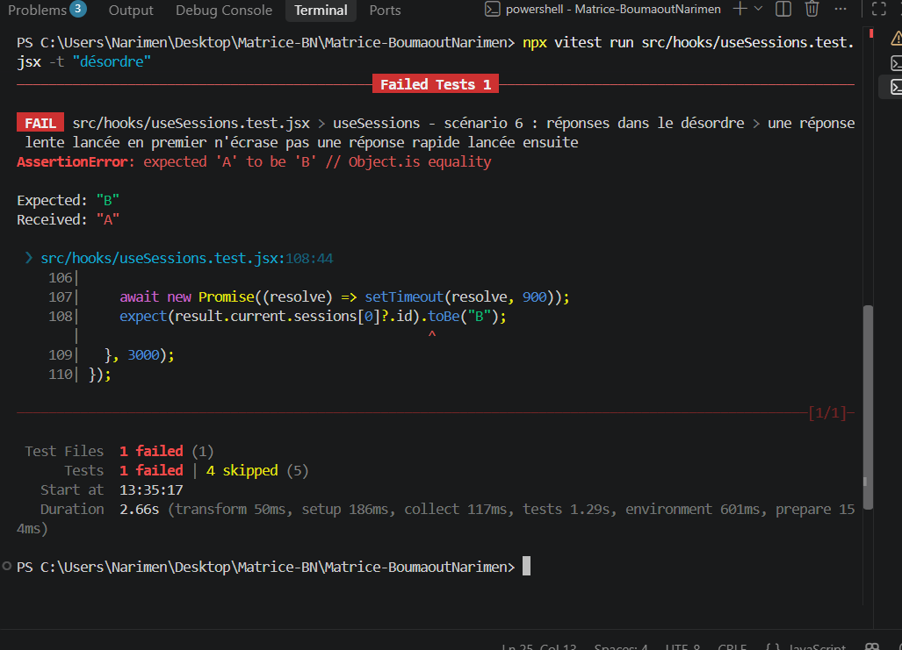
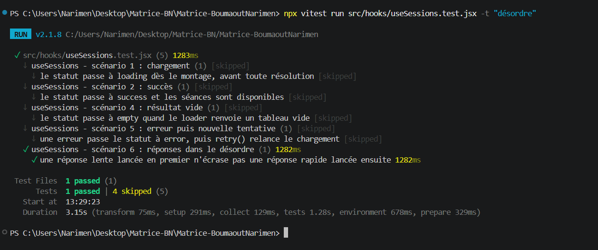
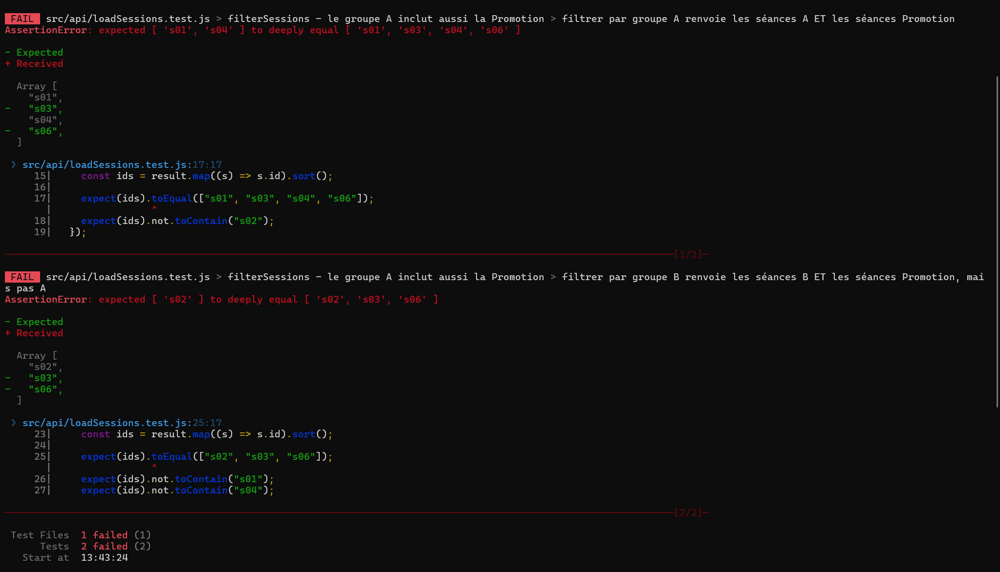
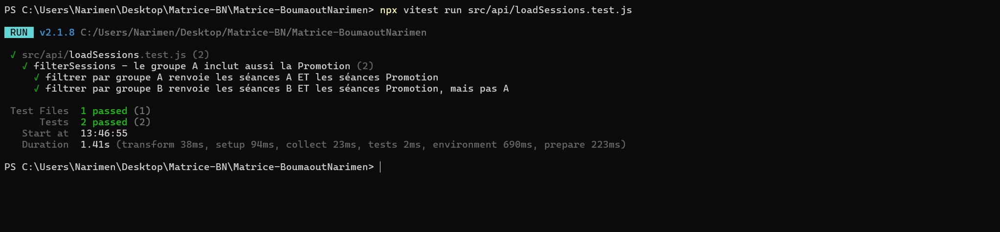
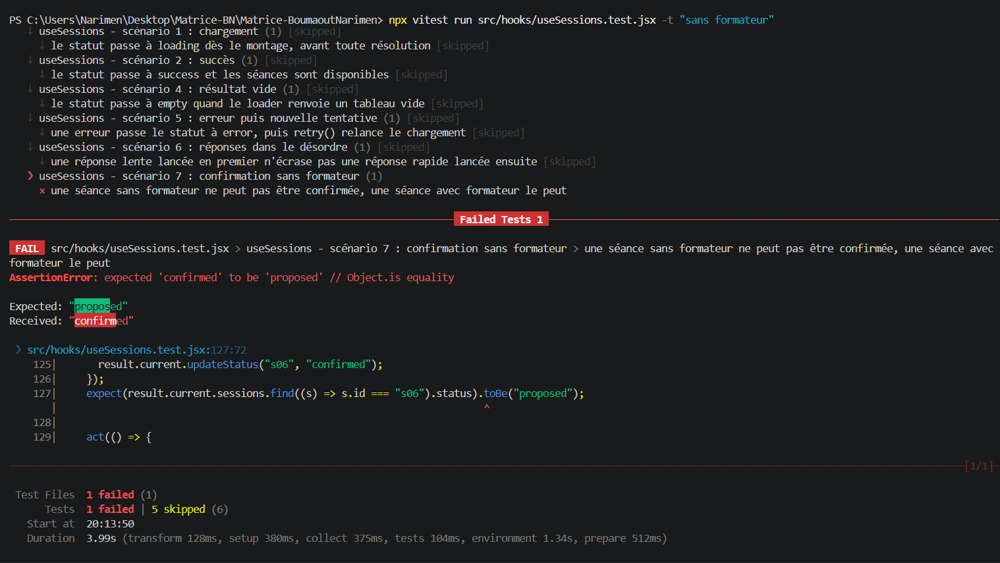
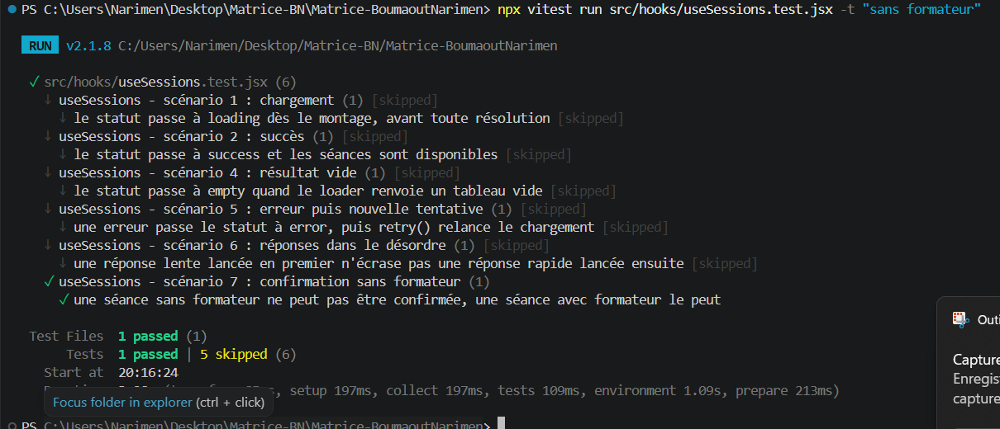
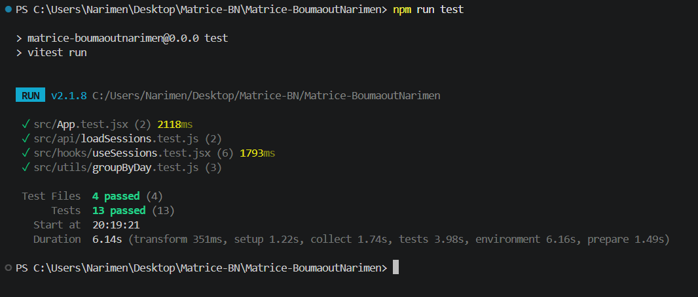

# Preuves F2 : tests rouges puis verts

## Principe

Chaque preuve montre un test **rouge** (il échoue), puis **vert** (il passe après correction). Pour les preuves 1 et 2, je retire volontairement une ligne du code, je lance le test, je restaure la ligne avec `git restore`, puis je relance le même test : les défauts sont introduits exprès, pour vérifier que les tests détectent bien la panne. Pour la preuve 3, le défaut était réel : j'ai écrit le test, il a échoué sur le code d'origine, puis j'ai corrigé le code.

## Preuve 1 : réponses dans le désordre

- **Test** : `useSessions - scénario 6 : réponses dans le désordre` (fichier `src/hooks/useSessions.test.jsx`)
- **Ligne retirée** : dans `src/hooks/useSessions.js`, les deux lignes `if (requestId !== requestIdRef.current) return;`
- **Commande** : `npx vitest run src/hooks/useSessions.test.jsx -t "désordre"`

**Rouge** : sans la protection, le test échoue avec `expected 'A' to be 'B'` (attendu `"B"`, reçu `"A"`) à la ligne 108 : la réponse lente de A, arrivée en retard, a écrasé celle de B.

**Vert** : protection restaurée, le test passe.

## Preuve 2 : règle « A affiche A + Promotion »

- **Tests** : les deux tests de `src/api/loadSessions.test.js`
- **Ligne retirée** : dans `filterSessions` (`src/api/loadSessions.js`), la condition `|| session.group === "Promotion"`
- **Commande** : `npx vitest run src/api/loadSessions.test.js`

**Rouge** : les séances Promotion disparaissent. Pour le groupe A, reçu `[ 's01', 's04' ]` au lieu de `[ 's01', 's03', 's04', 's06' ]` ; pour le groupe B, reçu `[ 's02' ]` au lieu de `[ 's02', 's03', 's06' ]`.

**Vert** : condition restaurée, les deux tests passent.

## Preuve 3 : une confirmation exige un formateur

- **Test** : `useSessions - scénario 7 : confirmation sans formateur` (fichier `src/hooks/useSessions.test.jsx`)
- **Défaut** : la règle du sujet « une confirmation exige un formateur » n'était pas appliquée : `updateStatus` acceptait de confirmer « Travail autonome » (sans formateur).
- **Commande** : `npx vitest run src/hooks/useSessions.test.jsx -t "sans formateur"`

**Rouge** : le test, écrit avant la correction, échoue sur le code d'origine avec `expected 'confirmed' to be 'proposed'` (ligne 127) : la séance sans formateur est passée à « confirmed ».

**Vert** : après la correction dans `updateStatus` (refus de la confirmation sans formateur), le test passe.

Cette preuve diffère des deux premières : le défaut n'a pas été introduit volontairement, c'était un vrai défaut de mon application, constaté puis corrigé.

## Suite complète

Commande non interactive : `npm run test`, 13 tests réussis dans 4 fichiers.

## Tableau des scénarios

| Scénario | Entrée | Attente | Risque couvert |
| --- | --- | --- | --- |
| Chargement | montage du hook avec un loader lent (50 ms) | statut `loading` | écran figé ou vide pendant l'attente |
| Succès | loader qui renvoie une séance | statut `success`, séance disponible | liste qui ne s'affiche jamais |
| Résultat vide | loader qui renvoie `[]` | statut `empty` | confondre « aucun résultat » et « succès » |
| Erreur puis nouvelle tentative | loader qui échoue, puis `retry()` | statut `error`, puis `success`, loader appelé 2 fois | erreur sans issue pour l'utilisateur |
| Réponses dans le désordre | A lancé à t = 0 (800 ms), B à t = 100 ms (200 ms) | l'écran reste sur B après l'arrivée de A | réponse périmée qui écrase la plus récente |
| A inclut la Promotion | `filterSessions` avec le groupe A, puis B | A voit A + Promotion, jamais B (et inversement) | séances communes masquées |
| Nom accessible du filtre | rendu de l'application | un champ de texte nommé « Recherche » | champ inutilisable avec un lecteur d'écran |
| Utilisation au clavier | trois Tab, puis saisie de « Authentification » | focus sur la recherche, liste filtrée | filtre inaccessible sans souris |
| Regroupement par jour | séances de plusieurs jours, matin et après-midi mélangés | jours triés, matin avant après-midi, libellé en français, liste vide gérée | liste dans le désordre ou libellés incorrects |
| Confirmation sans formateur | `updateStatus("s06", "confirmed")` sur une séance sans formateur, puis `updateStatus("s04", "confirmed")` sur une séance avec formateur | s06 reste « proposed », s04 passe à « confirmed » | séance sans formateur confirmée, contre la règle du sujet |

## Configuration de test

- Outils : Vitest 2.1.8, React Testing Library, jest-dom, user-event, jsdom.
- Configuration : `vite.config.js` (bloc `test`) et `src/test/setup.js`.
- Dépendances verrouillées : `package-lock.json`.
- Commande non interactive : `npm run test`.

## Limites de la stratégie

- Les preuves 1 et 2 portent sur des défauts introduits volontairement : elles prouvent que les tests détectent ces pannes, pas qu'ils ont découvert des bugs réels. La preuve 3 porte sur un défaut réel de l'application.
- Les tests du hook remplacent `loadSessions` par un faux loader : le vrai délai de 400 ms n'est pas testé.
- Le test des réponses dans le désordre utilise de vrais délais (environ 1,3 s) et peut être sensible à la charge de la machine.
- Aucun test ne vérifie le rendu visuel (couleurs, responsive) : ces points sont couverts par les captures de F3.
- Les tests de l'interface (`App.test.jsx`) utilisent le vrai `loadSessions` avec son délai de 400 ms : ils sont plus lents et dépendent de ce délai.
- Seul le champ de recherche est vérifié pour le nom accessible et le clavier ; les deux menus (groupe, domaine) et la modale sont testés à la main (protocole clavier de F3), pas par des tests automatiques. L'option « Confirmée » désactivée dans la modale a aussi été vérifiée à la main.