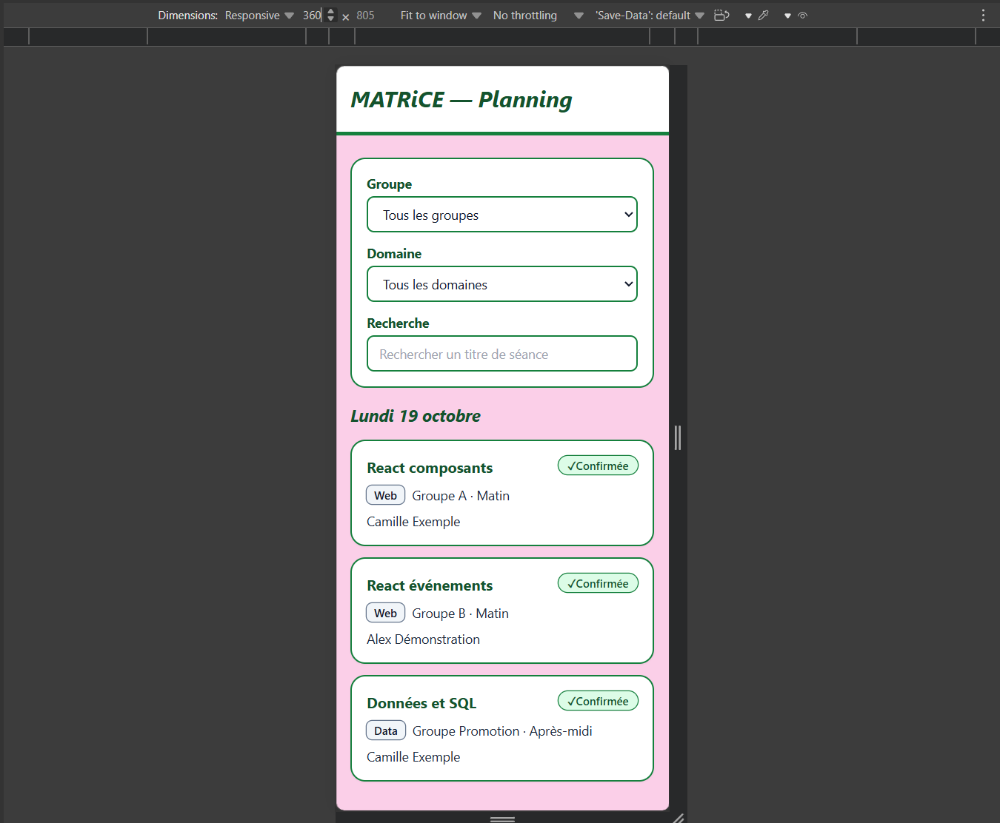
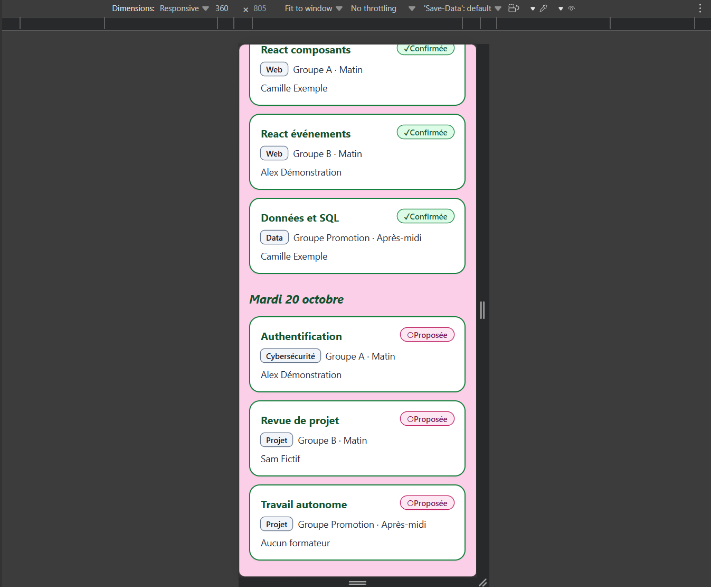
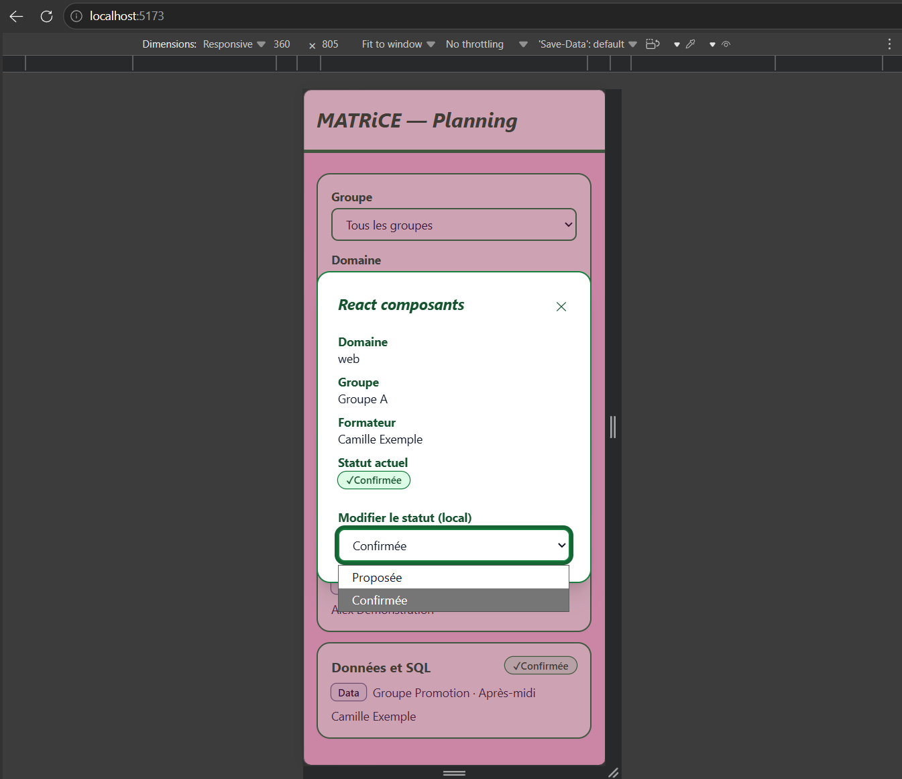
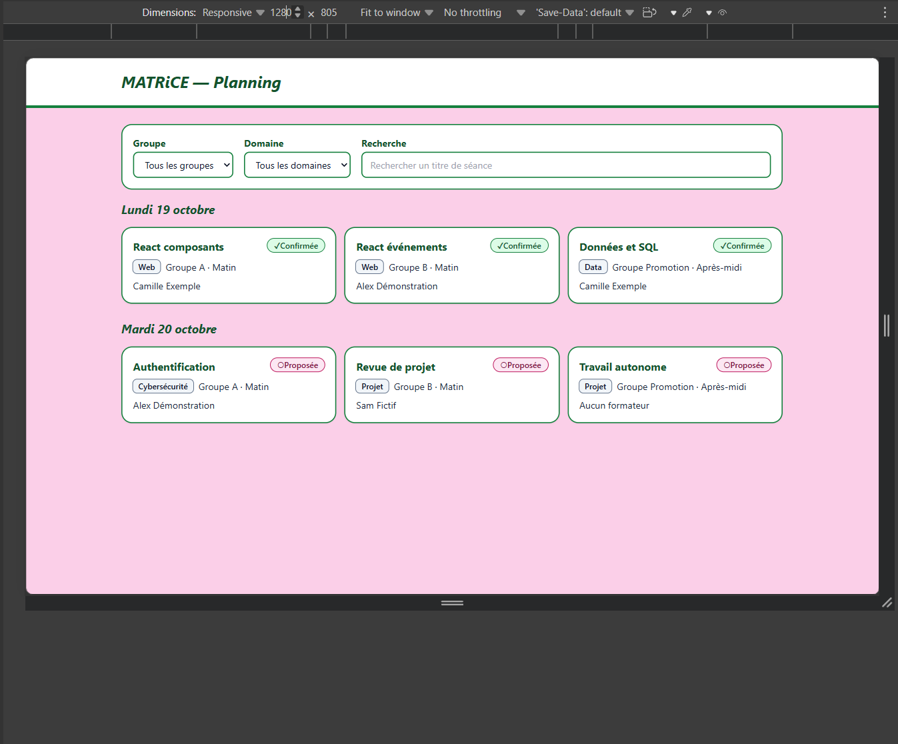
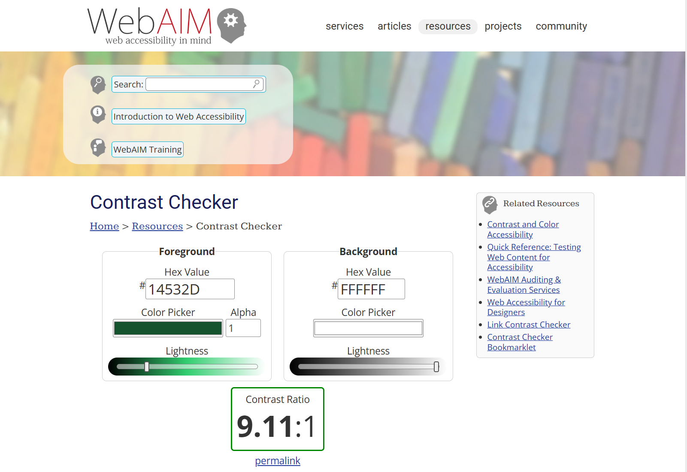
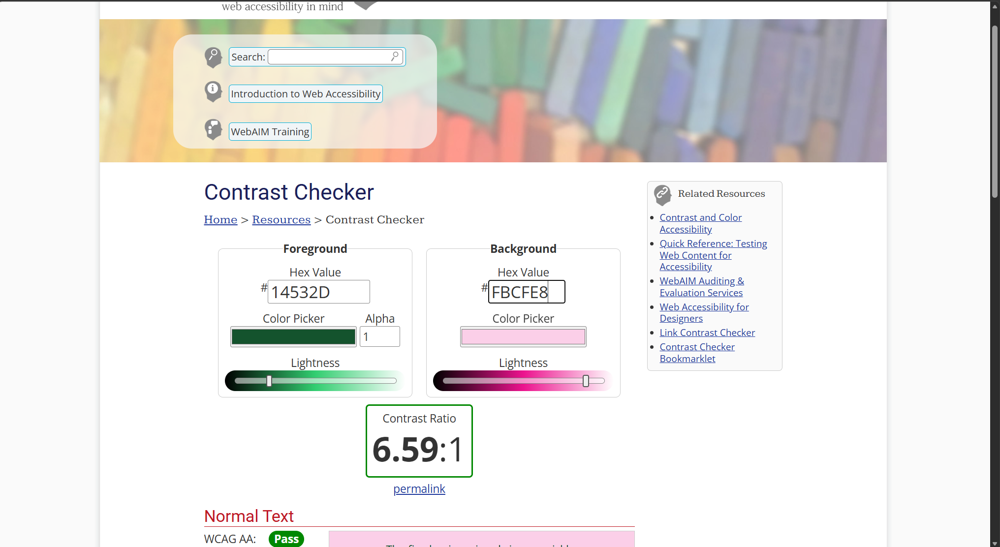
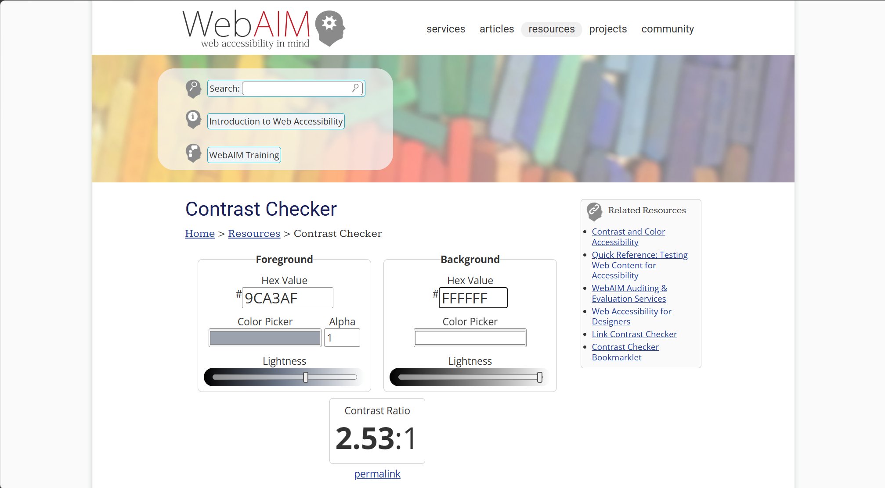
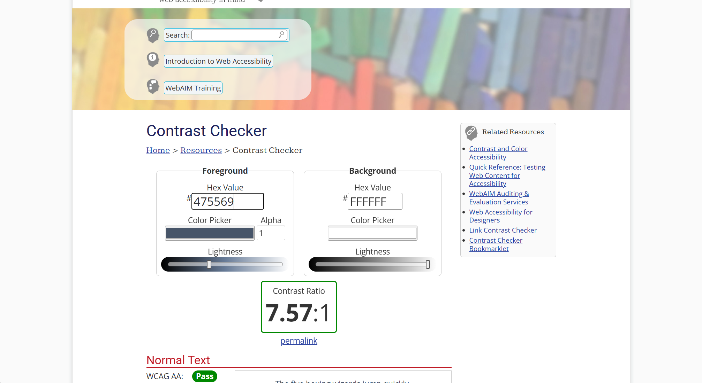

# Preuves F3 : bibliothèque UI, accessibilité, responsive

Bibliothèque utilisée : **Tailwind CSS 3.4** (classes utilitaires dans les composants).

## 1. Captures à 360 px et 1280 px

Captures prises dans les outils de développement du navigateur (mode appareil, largeur indiquée dans la barre du haut).

**360 px**, filtres empilés, cartes sur une colonne, aucun débordement horizontal :

**360 px, détail ouvert** : la modale tient dans l'écran, le ✕ et le menu de statut restent accessibles.

**1280 px** : trois colonnes sous chaque jour.

## 2. Protocole de navigation au clavier

Test fait à la main, sans souris, une fois la page chargée.

| Étape | Action | Résultat observé |
| --- | --- | --- |
| 1 | `Tab` depuis le haut de la page | l'anneau de focus vert épais apparaît sur le menu Groupe, puis Domaine, puis Recherche, puis les cartes |
| 2 | `Entrée` sur une carte | la modale s'ouvre, le focus est déplacé sur le bouton ✕ |
| 3 | `Tab` et `Maj + Tab` dans la modale | le focus tourne entre le ✕ et le menu de statut, sans sortir de la modale |
| 4 | `Echap` | la modale se ferme |
| 5 | après la fermeture | le focus revient sur la carte qui avait ouvert la modale |

Un test automatique vérifie en plus que le champ de recherche a le nom accessible « Recherche » et qu'on peut le remplir au clavier (`src/App.test.jsx`).

## 3. Mesures de contraste

Outil : WebAIM Contrast Checker. Seuil retenu : **4,5:1** (texte normal, WCAG AA).

| N° | Usage | Texte | Fond | Ratio | Verdict |
| --- | --- | --- | --- | --- | --- |
| 1 | Titres, labels, noms de séance | `#14532d` | `#ffffff` | 9,11 | réussi |
| 2 | Texte courant des cartes | `#0f172a` | `#ffffff` | 17,85 | réussi |
| 3 | Titre du jour, posé sur le fond rose | `#14532d` | `#fbcfe8` | 6,59 | réussi |
| 4 | Badge « Confirmée » | `#14532d` | `#dcfce7` | 8,29 | réussi |
| 5 | Badge « Proposée » | `#831843` | `#fce7f3` | 8,20 | réussi |
| 6 | Badge de domaine | `#0f172a` | `#f1f5f9` | 16,29 | réussi |
| 7 | Bouton « Réessayer » | `#ffffff` | `#166534` | 7,13 | réussi |
| 8 | Texte d'aide de la recherche, avant correction | `#9ca3af` | `#ffffff` | 2,53 | **échec** |
| 8 | Texte d'aide de la recherche, après correction | `#475569` | `#ffffff` | 7,57 | réussi |

**Défaut trouvé et corrigé** : le texte d'aide du champ de recherche, gris clair par défaut de Tailwind, n'atteignait que 2,53:1. J'ai ajouté la classe `placeholder:text-slate-600` dans `FIELD_CLASS` (`src/components/FiltersBar.jsx`) : 7,57:1.

## 4. Trois décisions justifiées

### Hiérarchie carte / détail

Le sujet demande un affichage minimal sur chaque séance (titre, domaine, groupe, formateur, statut) et un détail qui s'ouvre sur une action. J'ai gardé les cartes courtes pour que la liste se parcoure d'un coup d'œil, surtout à 360 px où les cartes sont empilées sur une colonne. Le détail et la modification du statut sont dans la modale, ouverte à la demande, sans changer de page. La liste est aussi regroupée par jour (titre de niveau 2), ce qui donne un niveau de lecture de plus : jour, séance, détail.

### Lisibilité des statuts

Le statut ne repose pas sur la couleur seule, car une personne qui distingue mal le vert du rose ne verrait pas la différence. J'ai donc ajouté le texte (« Confirmée », « Proposée ») et un symbole (✓ ou ○) : le statut se comprend même sans les couleurs. Le badge de domaine a une forme différente (coins peu arrondis, contre des coins très arrondis pour le statut), pour qu'on ne confonde pas les deux. Les contrastes des badges sont de 8,29 et 8,20.

### Accès aux actions

Chaque carte est un `<button>` plutôt qu'une `div` cliquable, parce que le navigateur le rend atteignable avec Tab et activable avec Entrée ou Espace sans code supplémentaire, et qu'un lecteur d'écran l'annonce comme un bouton. Avec une `div`, il aurait fallu recréer tout ça à la main. La modale pilote aussi le clavier : le focus y entre à l'ouverture, reste piégé dedans, Echap la ferme, et le focus revient sur la carte. Le statut se modifie avec un menu natif relié à un label. L'anneau de focus épais (`ring-4`) reste visible sur le fond blanc et sur le fond rose.

## 5. Limites

- Les captures viennent de l'émulation du navigateur, pas d'un vrai téléphone.
- Les mesures de contraste portent sur les textes ; je n'ai pas mesuré celui des bordures ni de l'anneau de focus.
- Seul le champ de recherche est couvert par un test automatique d'accessibilité ; la modale est vérifiée à la main.
- Les captures de mise en page ont été prises avant la correction du texte d'aide de la recherche : le champ y apparaît encore avec l'ancien gris clair.
- La modale reprend en grande partie les informations de la carte ; son apport principal est la modification du statut.